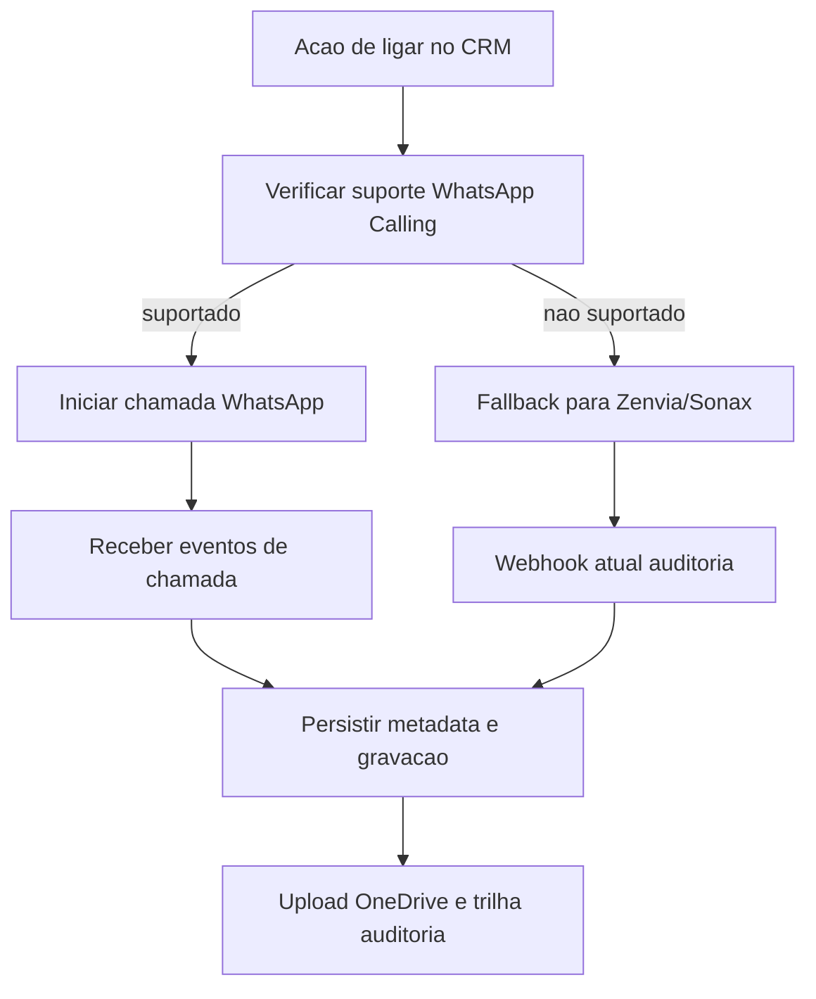

# WhatsApp Calling com Gravação: Opções de Mercado e Decisão

## Contexto atual do projeto

O sistema já possui trilha de auditoria de chamadas com:

- provedores `ZENVIA` e `SONAX` no modelo `AuditoriaLigacao`;
- webhook de atualização de status e gravação em `crm_app/auditoria_ligacoes_api.py`;
- sincronização de mídia para OneDrive quando há `link_gravacao_provedor`.

Isso permite evoluir para WhatsApp Calling sem perder o legado de gravação já em produção.

## To-do 1: Mapeamento de provedores (2-3 opções)

### Provedor A: Meta WhatsApp Business Calling (direto)

- **Canal**: WhatsApp nativo.
- **Ponto forte**: experiência no app do cliente.
- **Risco**: disponibilidade por conta/região/regras de permissão; maturidade ainda em evolução.
- **Gravação**: depende da forma de integração (SIP/CPaaS parceiro) e da política do stack adotado.
- **Quando usar**: quando WhatsApp Calling estiver habilitado para seu WABA e houver requisito forte de voz nativa no WhatsApp.

### Provedor B: Twilio (WhatsApp Calling + Voice/Recording)

- **Canal**: WhatsApp Calling integrado ao Twilio Programmable Voice.
- **Ponto forte**: API madura para gravação (`Recordings`), callbacks, canais dual e governança operacional.
- **Restrições relevantes**:
  - chamadas para destinos WhatsApp nao conectam em PSTN no mesmo fluxo;
  - regras de permissão para chamadas outbound e restrições por países.
- **Quando usar**: quando precisa de engenharia robusta de voz, webhooks e rastreabilidade fim-a-fim.

### Provedor C: Manter Zenvia/Sonax para fallback de voz gravada

- **Canal**: telefonia/click2call já integrada.
- **Ponto forte**: aproveita o pipeline existente de gravação e arquivamento.
- **Risco**: experiência do usuário não é chamada nativa pelo WhatsApp.
- **Quando usar**: fallback obrigatório para garantir continuidade e SLA.

## To-do 2: Arquitetura de fallback recomendada

### Princípio

Tentar WhatsApp Calling primeiro. Se não houver capacidade confirmada (conta, região, permissão, indisponibilidade), cair automaticamente para o provedor de voz gravada já suportado.

### Fluxo alvo

### Contrato técnico mínimo

- **ID correlacionado único** por tentativa (`attempt_id`) para unir evento de WhatsApp e fallback.
- **Normalização de status** em uma taxonomia única (`INICIADA`, `PROCESSANDO`, `FINALIZADA`, `ARQUIVADA`, `ERRO`).
- **Estratégia de roteamento**:
  - `prefer_whatsapp_calling=true`: tenta WhatsApp, fallback automático;
  - `prefer_whatsapp_calling=false`: usa voz legada direto.
- **Registro de decisão** no payload (`motivo_fallback`) para auditoria operacional.

## To-do 3: Requisitos mínimos de compliance (LGPD)

### Base mínima para gravar chamadas

- Aviso claro de gravação antes do início da conversa.
- Registro do fundamento legal e da finalidade no contexto da chamada.
- Política de retenção com prazo definido e descarte automático.
- Mecanismo de busca/entrega/exclusão mediante solicitação do titular.
- Controle de acesso por perfil, trilha de auditoria e logs de acesso à mídia.

### Checklist operacional

- Criptografia em trânsito (TLS) e em repouso no storage final.
- Segregação entre metadata de chamada e URL de mídia.
- URL de gravação com expiração curta ou proxy interno autenticado.
- Procedimento de incidentes para vazamento/acesso indevido.

## To-do 4: Matriz de decisão

| Critério | Meta direto | Twilio (WA + Voice) | Zenvia/Sonax (fallback) |
| --- | --- | --- | --- |
| Cobertura e previsibilidade | Média | Alta | Alta |
| Maturidade de gravação | Baixa a média (varia) | Alta | Alta (já implantado) |
| Complexidade de integração | Alta | Média | Baixa (reuso) |
| Custo inicial | Médio | Médio/alto | Baixo (incremental) |
| SLA operacional imediato | Médio | Alto | Alto |
| Risco regulatório de implantação | Médio | Médio | Baixo/médio |

## Recomendação objetiva

1. Manter `ZENVIA/SONAX` como trilho de fallback obrigatório.
2. Fazer piloto controlado com Twilio para chamadas WhatsApp e validar gravação end-to-end.
3. Somente após evidência de estabilidade, ampliar tráfego do WhatsApp Calling gradualmente.

## Evidências de mercado consultadas

- Meta Developers: seção oficial de Calling no WhatsApp Business Platform.
- Twilio Docs: WhatsApp Business Calling e API de Recordings.
- Prática de mercado CPaaS/contact center: adoção de arquitetura híbrida para reduzir risco de feature gap.
